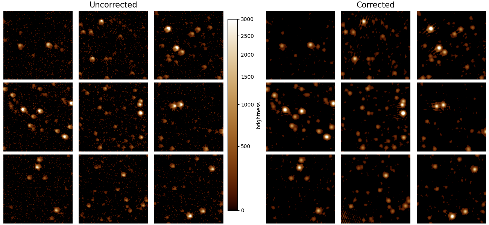

Examples
==========

In this example, we'll walk through correcting an image using an ``ArrayCorrector``.
It's recommended to read at least the first section of :doc:`the concepts description <concepts>` first.

Demo: correcting DASH image
---------------------------

This tutorial uses an image from the Demonstration Airglow-Subtracted Heliospheric
imager (DASH) as an example. For details on DASH see Section 4.2 of the
`accompanying paper <https://iopscience.iop.org/article/10.3847/1538-3881/acc578>`_.

Here is a visualization of the result we're aiming to produce.

    Image patches in a DASH image before and after PSF regularization.
    Left: Stars in each region exhibit a varying PSF before correction.
    Right: After application of a transfer PSF, the stars are more uniform across the image.
    The panels are gamma-corrected to highlight the periphery of the original and regularized PSFs.

Defining input parameters
~~~~~~~~~~~~~~~~~~~~~~~~~

Before you can correct an image, you need a PSF model for the system that collected the image.
You can either define a **functional model** or an **array model.** A functional
model is defined by an equation whereas an array model uses the data directly as the model.
For most purposes, we recommend an array model because deriving the correct functional form
can be tricky. Thus, this quickstart tutorial walks through the array model PSF model form.

First, we need to define both the ``psf_size`` and the ``patch_size``. This technique breaks the image into
overlapping square neighborhoods of length ``patch_size`` on each side. In this case a ``patch_size`` of 256 indicates
we use a ``256x256`` neighborhood size. However, we know for
this instrument that the PSF is more compact than this, i.e. a star will not contribute light over the full neighborhood.
For computational efficiency reasons, we thus use a ``psf_size`` of ``32x32``. For each star, a box centered on the star
of size ``32x32`` pixels is extracted. These are averaged to create the PSF model. The region outside the ``32x32`` box but
within ``256x256`` pixel window is filled with the median of the image.

Finally, we need to set the target PSF model's parameters. In this case, we will simply use a
symmetric Gaussian and thus have one parameter: the full-width-half-maximum (FWHM). We set this at 3.25 pixels. ::

    import numpy as np
    from astropy.io import fits
    from regularizepsf import CoordinatePatchCollection, simple_psf

    # Define the parameters and image to use
    psf_size = 32
    patch_size = 256
    target_fwhm = 3.25
    image_fn = "data/DASH.fits"

Build the target PSF
~~~~~~~~~~~~~~~~~~~~~

We first create a target PSF model by defining
a Python function that has inputs of ``x`` and ``y`` and outputs the value of the PSF at ``(x,y)``.
This is a functional model and is thus decorated with the ``simple_psf`` decorator. We evaluate the model over the full
patch size. ::

    # Define the target PSF
    center = patch_size / 2
    sigma = target_fwhm / 2.355

    @simple_psf
    def target(x, y, x0=center, y0=center, sigma_x=sigma, sigma_y=sigma):
        return np.exp(-(np.square(x - x0) / (2 * np.square(sigma_x)) + np.square(y - y0) / (2 * np.square(sigma_y))))

    target_evaluation = target(*np.meshgrid(np.arange(patch_size), np.arange(patch_size)))

Building the ``ArrayCorrector``
~~~~~~~~~~~~~~~~~~~~~~~~~~~~~~~

Everything else is handled in the `find_stars_and_average` method on the `CoordinatePatchCollection`.
It takes a list of images, the `psf_size`, and the `patch_size`. The function's signature is:

.. autofunction:: regularizepsf.fitter.CoordinatePatchCollection.find_stars_and_average

We convert from a ``CoordinatePatchCollection`` object
to an ``ArrayCorrector`` using the ``to_array_corrector`` method.
It requires an evaluated target PSF, which we constructed
in the previous section. ::

    # Extract all the stars from that image and create a PSF model with a target PSF
    coordinate_patch_collection = CoordinatePatchCollection.find_stars_and_average(
        [image_fn], psf_size, patch_size)
    array_corrector = coordinate_patch_collection.to_array_corrector(target_evaluation)

Performing the correction
~~~~~~~~~~~~~~~~~~~~~~~~~~~

Now we have all the components. It's time to correct the image! We open it as a ``numpy`` array and then use the
``array_corrector`` to correct.

.. warning::
    The image data type *must be* float. Otherwise, you will receive a somewhat cryptic error about DTYPEs not matching.
    It also must match the endianness of your computer. This can be a problem as many computers are little-endian but FITS
    images are stored big-endian. This will be improved in future versions of regularizepsf.

Now we do the correction! ::

    # Load the image for correcting
    with fits.open(image_fn) as hdul:
        data = hdul[0].data.astype(float)

    # See the corrected result!
    corrected = array_corrector.correct_image(data, alpha=2.0, epsilon=0.3)

The signature of `correct_image` is:

.. autofunction:: regularizepsf.corrector.ArrayCorrector.correct_image

You can save the ``ArrayCorrector`` for future use instead of having to derive it for each image image. This is done by simply::

    array_corrector.save("path_to_save.psf")

Demo: Correction PUNCH Data
----------------------------

As part of the `DASH 2023 Conference <https://dash.heliophysics.net/2023/>`_ we prepared an example with PUNCH data.
You can find it and run it `on Deepnote here <https://deepnote.com/workspace/jmbhughes-b5bcd10e-c247-4a9b-b119-b4de46b68c17/project/DASH2023-demo-fe9e0338-9bcb-4f3c-ae5c-eb0881882c2b/notebook/demo-6ed79daf848c481a97da2e0051e4f72b>`_.
