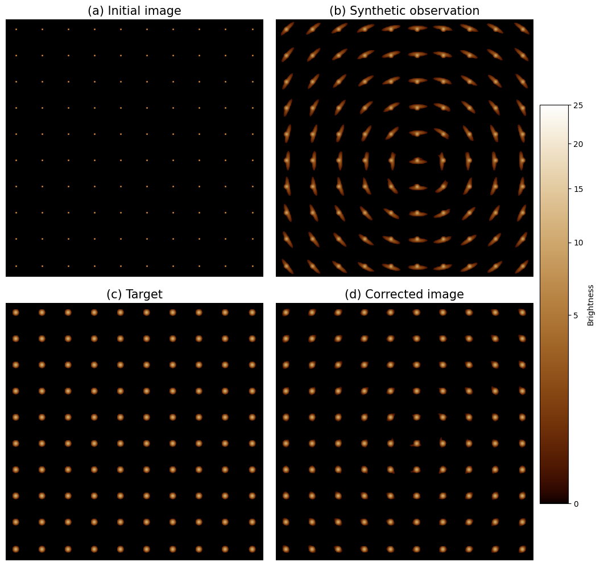

Welcome to regularizepsf!
=========================================

**regularizepsf** is a Python package (with Cython speed improvements) for determining and correcting
point spread functions in astronomical images. It was originally developed for the `PUNCH`_ mission
and is documented in `an Astronomical Journal paper`_.

Below is an example of correcting model data using the package.
An initial image of a simplified starfield (a) is synthetically observed with a slowly varying PSF (b),
then regularized with this technique (c). The final image visually matches a direct convolution of the initial image
with the target PSF (d). The panels are gamma-corrected to highlight the periphery of the model PSFs.

.. toctree::
   :maxdepth: 2
   :caption: Contents:

   concepts
   example.ipynb
   help
   cite
   development

Indices and tables
==================

* :ref:`genindex`
* :ref:`modindex`
* :ref:`search`

.. _PUNCH: https://punch.space.swri.edu/
.. _an Astronomical Journal paper: https://iopscience.iop.org/article/10.3847/1538-3881/acc578
